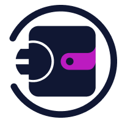

## Project Phases
- Phase 1: Implemented Minimal Viable Integration (MVI) with ICP transaction support, DID 
integration, and wallet management.
- Phase 2: Implemented smart contract interactions with `icrc2_approve` and `icrc2_transfer_from`.
- Phase 3: Implemented cross-chain swaps (`swap_icp_to_btc`) and planned security audits.


<div align="center">
  <h1>WalletD</h1>

  

[](https://app.fossa.com/projects/git%2Bgithub.com%2Fwalletd%2Fwalletd?ref=badge_shield) 

  <p>Library for building blockchain / web3 apps.</p>
</div>
⚠️ This project is under heavy development. Expect bugs & breaking changes prior to v1.0.0's release.

Supports (or should support)

- Generation of mnemonic phrases
- Importing of mnemonic phrases
- Generation of Hierarchical Deterministic (HD) wallets
- Importing of HD wallets
- Support for Bitcoin, Ethereum, and other blockchains

## Installing Rust

Rust can be installed using your package manager of choice or
[rustup.rs](https://rustup.rs).

## Building

The library can be built and tested using [`cargo`](https://github.com/rust-lang/cargo/):

```
git clone git@github.com:walletd/walletd.git
cd walletd
cargo build
```

You can run tests with:

```
cargo test
```

Please refer to the [`cargo` documentation](https://doc.rust-lang.org/stable/cargo/) for more detailed instructions.

### Building the docs

Docs can be built using the following:

```
cargo doc --no-deps --open
```

## Contributing
If you are interested in contributing to WalletD, please take a look at our [CONTRIBUTING](https://github.com/walletd/walletd/blob/main/CONTRIBUTING.md).

## License
WalletD is distributed under the terms of both the MIT license and the Apache License (Version 2.0).

See [LICENSE-APACHE](LICENSE-APACHE) and [LICENSE-MIT](LICENSE-MIT) for details.
<a href="test"></a>
<div align="center" id="detailed-license-info">

[](https://app.fossa.com/projects/git%2Bgithub.com%2Fwalletd%2Fwalletd?ref=badge_large)

</div>
